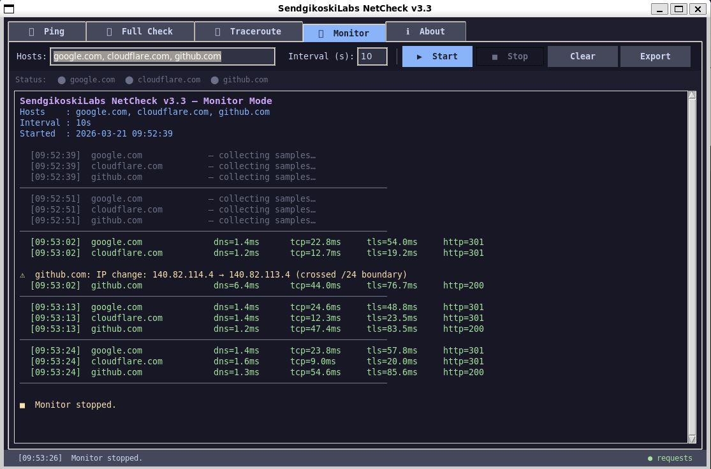
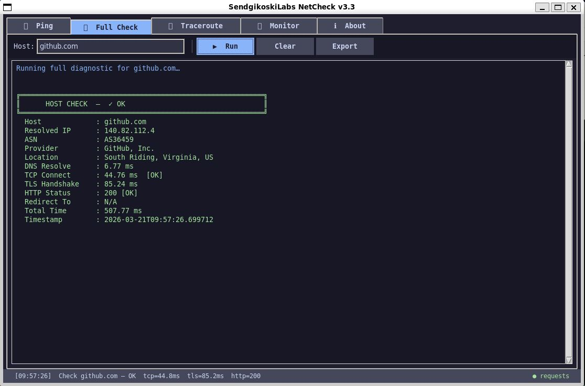
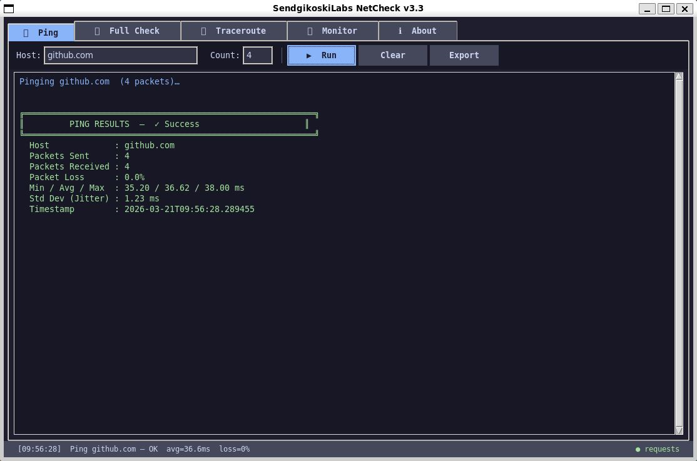
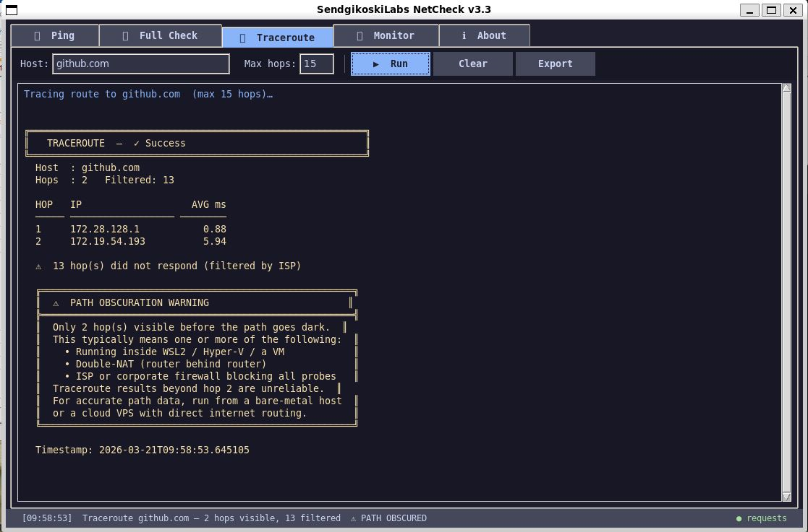
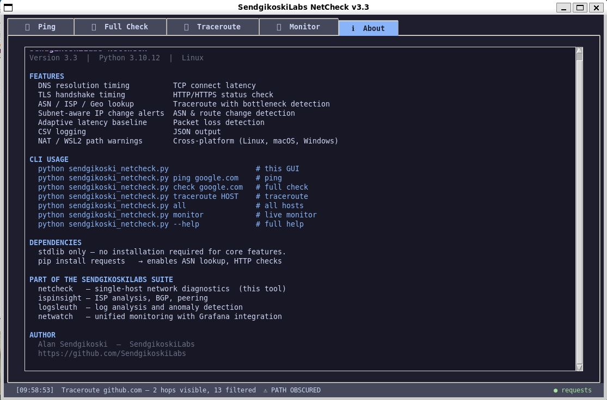
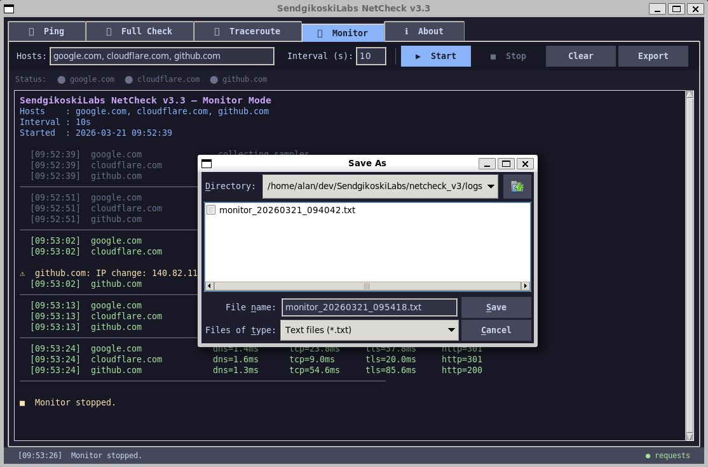
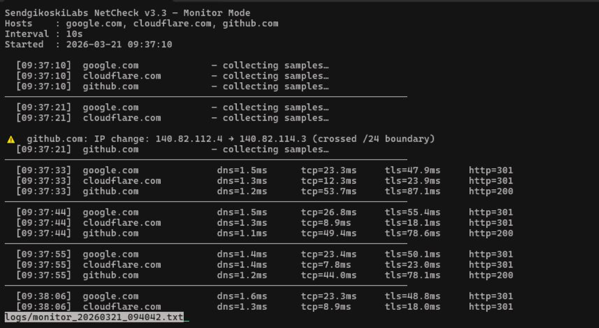
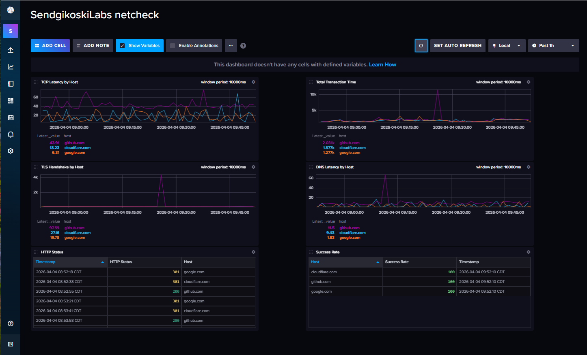

# SendgikoskiLabs NetCheck

**A professional, self-contained network diagnostic and monitoring tool.**

[](https://github.com/SendgikoskiLabs/netcheck_v3)
[](https://www.python.org/)
[]()
[]()

---

## Overview

NetCheck is a single-file Python tool that gives network engineers, sysadmins, and power users a complete picture of connectivity to any host — from DNS resolution through TLS handshake — with minimal installation.

Run it with no arguments to launch the dark-themed GUI. Pass a subcommand to use it from the CLI. Pipe `--json` output into your own tooling. Run `--monitor` to watch multiple hosts continuously with intelligent alerting.

Built by [Alan Sendgikoski](https://www.linkedin.com/in/alansendgikoski/) as part of the **SendgikoskiLabs** suite — professional-grade, open-source network tooling.

---

## Screenshots

### Monitor Tab

*Continuous multi-host monitoring with live DNS, TCP, TLS, and HTTP metrics. IP change alerts fire automatically when routing crosses a subnet boundary.*

### Full Check Tab

*Full diagnostic for a single host — DNS resolution, TCP connect, TLS handshake, HTTP status, ASN, ISP, and geolocation in one shot.*

### Ping Tab

*ICMP ping with min/avg/max latency, jitter (std dev), and packet loss. Results logged to the status bar.*

### Traceroute Tab

*Traceroute with automatic PATH OBSCURATION WARNING — detects WSL2, Hyper-V, double-NAT, and firewall environments where results are unreliable.*

### About Tab

*Built-in reference for CLI usage, features, dependencies, and the SendgikoskiLabs suite roadmap.*

### Export

*Every tab includes an Export button. Monitor sessions are saved with an auto-generated timestamped filename.*

### CSV Log File

*All checks are automatically logged to `logs/netcheck_log.csv` — ready for analysis, trend reporting, or InfluxDB import.*

### InfluxDB Dashboard

*A pre-built 6-panel InfluxDB dashboard — TCP Latency by Host, TLS Handshake by Host, DNS Latency by Host, Total Transaction Time, HTTP Status (table), Success Rate (table.)*

---

## Features

| Category | Capability |
|---|---|
| **Diagnostics** | DNS resolution timing, TCP connect latency, TLS handshake timing |
| **HTTP** | Status code check, redirect detection |
| **Enrichment** | ASN lookup, ISP name, geographic location |
| **Routing** | Traceroute with slow-hop bottleneck detection |
| **Monitor** | Continuous multi-host monitoring with adaptive latency baseline |
| **Alerting** | Latency spike detection, packet loss, IP/ASN/route change alerts |
| **Intelligence** | Subnet-aware IP change detection (suppresses anycast rotation noise) |
| **Environment** | NAT / WSL2 / double-NAT path obscuration warning in traceroute |
| **Output** | Formatted CLI output, JSON export, CSV logging |
| **Interface** | Dark-themed tkinter GUI with live status indicators |
| **Platform** | Linux, macOS, Windows — single file, no install |

---

## Requirements

**Python 3.8+** required for core features.

**Python Requests library** required for ASN lookup, ISP/geo enrichment, and HTTP checks.

**Python tkinter package** required for creating the graphical user interface (GUIs).

---

## Installation

**Ubuntu/Debian**
  
  👉 Install tkinter
  
    ```bash
    sudo apt update
    sudo apt install python3-tk
    ```
  
  👉 Download the code
  
     ```bash
    git clone https://github.com/SendgikoskiLabs/netcheck_v3.git
    cd netcheck_v3
    ```

  👉 Create a virtual environment (optional but recommended) and install modules

    ```bash
    python3 -m venv venv
    source venv/Scripts/activate
    pip install requests
    ```

**Redhat/macOS**
    
  👉 Install tkinter
  
    ```bash
    sudo yum update
    sudo yum install python3-tkinter
    ```
  
  👉 Download the code
  
     ```bash
    git clone https://github.com/SendgikoskiLabs/netcheck_v3.git
    cd netcheck_v3
    ```

  👉 Create a virtual environment (optional but recommended) and install modules

    ```bash
    python3 -m venv venv
    source venv/Scripts/activate
    pip install requests
    ```

**Windows**

  👉 Install Python-3 and Git. Open PowerShell in Windows Terminal and run the following commands:
  
    ```PowerShell
        winget configure -f https://aka.ms/python-config
        winget install --id Git.Git -e --source winget
    ```
    
    When the Python installation starts, a terminal window shows the setup steps and required installs. Review them, then confirm by selecting [Y] Yes or [N] No to continue.
  
  👉 Download the code. Open Windows Terminal and run the following commands:
  
     ```PowerShell
    git clone https://github.com/SendgikoskiLabs/netcheck_v3.git
    cd netcheck_v3
    ```
    
  👉 Create a virtual environment using Command Prompt (optional but recommended) and install modules

    ```Windows Command Prompt
    python -m venv venv
    .\venv\Scripts\activate
    pip install requests
    ```

  👉 Verify tkinter installation. A small window will appear.

    ```Windows Command Prompt
    python -m tkinter
    ```
---

## Usage

### GUI Mode

```bash
python sendgikoski_netcheck.py
```

Launches the full GUI with five tabs: **Ping**, **Full Check**, **Traceroute**, **Monitor**, and **About**. All tabs support Export to file. The Monitor tab shows live colored status indicators per host and updates the status bar in real time.

---

### CLI Mode

```bash
# Ping
python sendgikoski_netcheck.py ping google.com
python sendgikoski_netcheck.py ping google.com -c 10

# Full diagnostic (DNS + TCP + TLS + HTTP + ASN)
python sendgikoski_netcheck.py check google.com

# Traceroute
python sendgikoski_netcheck.py traceroute google.com
python sendgikoski_netcheck.py traceroute google.com -m 20

# Run full check on all default hosts
python sendgikoski_netcheck.py all

# Continuous monitor (default hosts, 10s interval)
python sendgikoski_netcheck.py monitor

# Monitor specific hosts at custom interval
python sendgikoski_netcheck.py monitor --hosts github.com cloudflare.com -i 30

# JSON output (any command)
python sendgikoski_netcheck.py check google.com --json

# Help
python sendgikoski_netcheck.py --help
```

---

## Monitor Mode

Monitor mode polls each host on a configurable interval and provides intelligent alerting:

```
SendgikoskiLabs NetCheck v3.6  —  Monitor Mode
Hosts: google.com, cloudflare.com, github.com
Interval: 10s   (Ctrl+C to stop)

  [14:04:01]  google.com              dns=  1.54ms  tcp= 25.90ms  tls= 57.49ms  http=301 [REDIRECT]
  [14:04:12]  cloudflare.com          dns=  1.48ms  tcp=  9.65ms  tls= 22.79ms  http=301 [REDIRECT]
  [14:04:22]  github.com              dns=  6.47ms  tcp= 50.73ms  tls= 84.79ms  http=200 [OK]

⚠️ LATENCY SPIKE: google.com  avg=182.3ms  baseline=28.1ms
⚠️ github.com: IP change: 140.82.114.4 → 140.82.113.3 (crossed /24 boundary)
🚨 PACKET LOSS: cloudflare.com  25%
```

**Alert types:**

| Alert | Trigger |
|---|---|
| `⚠️ LATENCY SPIKE` | Average latency exceeds 2× adaptive baseline |
| `🚨 PACKET LOSS` | TCP failure rate exceeds 20% in recent window |
| `⚠️ IP change` | Resolved IP crosses a /24 subnet boundary (genuine re-route) |
| `🚨 ASN change` | IP resolves to a different autonomous system (provider change) |
| `⚠️ Route change` | Traceroute hop sequence changes between cycles |

Intra-subnet IP rotation (e.g. Google and GitHub anycast load balancing) is **silently suppressed** by default to avoid false-positive noise.

---

## CSV Logging

Every `check`, `all`, and `monitor` run appends results to `logs/netcheck_log.csv`:

```
timestamp,host,ip,dns_ms,tcp_ms,tls_ms,http_status,total_ms
2026-03-20T12:11:07,google.com,64.233.185.100,11.74,34.23,124.41,301,548.66
2026-03-20T12:11:08,cloudflare.com,104.16.133.229,11.56,19.07,24.19,301,279.87
2026-03-20T12:11:08,github.com,140.82.112.3,9.14,51.80,81.47,200,479.80
```

The log directory is created automatically on first run.

---

## Traceroute & NAT Detection

NetCheck automatically detects when traceroute results are likely obscured by a NAT layer, hypervisor, or firewall:

```
  ╔══════════════════════════════════════════════════════╗
  ║  ⚠  PATH OBSCURATION WARNING                        ║
  ╠══════════════════════════════════════════════════════╣
  ║  Only 2 hop(s) visible before the path goes dark.   ║
  ║  This typically means one or more of the following: ║
  ║    • Running inside WSL2 / Hyper-V / a VM           ║
  ║    • Double-NAT (router behind router)              ║
  ║    • ISP or corporate firewall blocking all probes  ║
  ║  For accurate path data, run from a bare-metal host ║
  ║  or a cloud VPS with direct internet routing.       ║
  ╚══════════════════════════════════════════════════════╝
```

This warning fires automatically when ≤2 hops are visible and ≥3 are filtered — no configuration required.

---

## JSON Output

Any command accepts `--json` / `-j` for machine-readable output:

```bash
python sendgikoski_netcheck.py check github.com --json
```

```json
{
  "host": "github.com",
  "ip": "140.82.114.3",
  "asn": "AS36459",
  "provider": "GitHub, Inc.",
  "location": "South Riding, Virginia, US",
  "dns_ms": 6.06,
  "tcp_ms": 51.10,
  "tls_ms": 111.44,
  "http_status": 200,
  "http_redirect": null,
  "total_ms": 504.19,
  "success": true,
  "timestamp": "2026-03-20T14:02:16.304076"
}
```

---

## InfluxDB Dashboard

A pre-built 6-panel InfluxDB dashboard template is included in the `dashboard/` folder.

**Panels:**
- TCP Latency by Host
- TLS Handshake by Host
- DNS Latency by Host
- Total Transaction Time
- HTTP Status (table)
- Success Rate (table)

**To use:**
- ***Note:*** InfluxDB must be fully configured with the JSON file before Step 3 below.
1. In InfluxDB UI → Dashboards → Import Dashboard
2. Select `dashboard/netcheck_dashboard.json`
3. Start `python sendgikoski_netcheck.py monitor --influx` to stream data into InfluxDB
4. Your dashboard is live instantly

---

## Default Hosts

The three default hosts used by `all` and `monitor` commands can be changed by editing the `DEFAULT_HOSTS` list near the top of the script:

```python
DEFAULT_HOSTS = [
    "google.com",
    "cloudflare.com",
    "github.com",
]
```

---

## Changelog

| Version | Changes |
|---|---|
| **3.8** | v3.8: Added InfluxDB export to monitor mode (v1.x + v2.x auto-detect). Config via influx.cfg, env vars, or --influx-* CLI flags |
| **3.7** | v3.7: Cap Windows max_hops to 10 by default, use -w 500 with -w before -h, guarantee timeout covers worst-case 4s/hop, OS-aware GUI default |
| **3.6** | v3.6: Reduce tracert -w to 1000ms to fix timeout on heavily filtered routes |
| **3.5** | v3.5: Fix Windows traceroute — cp850 encoding, -w 2000 flag, success on filtered hops |
| **3.4** | v3.4: Fix Windows traceroute parser — handle tracert output format differences |
| **3.3** | Redesigned GUI: tabbed toolbar layout, Export buttons, Enter-key shortcuts, live host status indicators, dynamic status bar, About tab |
| **3.2** | Fixed negative elapsed time in `all` command; added NAT/WSL2 path-obscuration warning in traceroute |
| **3.1** | Fixed Ctrl+C traceback in monitor mode; added subnet-aware IP change detection |
| **3.0** | Initial merged release — combined best of two codebases; fixed ASN tracking bug; added TLS timing, HTTP check, ASN/geo enrichment |

---

## Part of the SendgikoskiLabs Suite

NetCheck is the first tool in a planned suite of professional network utilities:

```
SendgikoskiLabs/
├── netcheck/     ← you are here
├── ispinsight/   # ISP analysis: BGP routes, peering, geolocation path
├── logsleuth/    # Log analysis: anomaly detection, trend reports
├── marketpulse/  # Market monitoring: real-time price feeds, alerts
└── netwatch/     # Unified platform with Grafana integration
```

Follow the project on GitHub for updates: [github.com/SendgikoskiLabs](https://github.com/SendgikoskiLabs)

---

## License

MIT License — free to use, modify, and distribute.
See [LICENSE](LICENSE) for full terms.

---

## Resources

[Microsoft] (https://learn.microsoft.com/en-us/windows/dev-environment/python?tabs=winget) · Set up your Python development environment on Windows

---

## Author

**Alan Sendgikoski**
15+ years in network systems engineering, DevOps automation, and Python tooling.
Former consultant for AT&T Wireless Labs, IBM Cloud, Ericsson, and Nokia Siemens Networks.

[LinkedIn](https://www.linkedin.com/in/alansendgikoski/) · [GitHub](https://github.com/SendgikoskiLabs)
